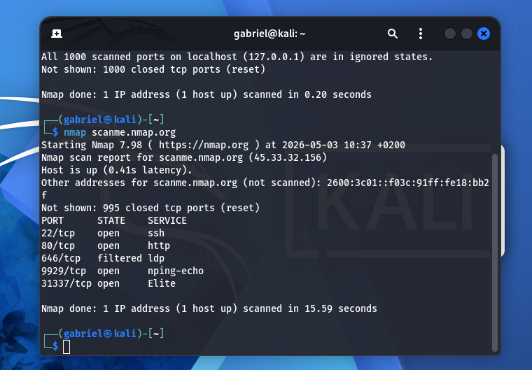

# 🔍 Analyse réseau : Scan de scanme.nmap.org

> **Objectif** : Identifier les services actifs sur une cible autorisée.

---

## Contexte

Utilisation de Nmap pour auditer `scanme.nmap.org`.  
Cette étape permet de valider la connectivité et la détection des services actifs.

---

## Méthodologie

- **Machine** : Kali Linux (ThinkPad i5)
- **Commande utilisée** : `nmap scanme.nmap.org`

---

## 📸 Preuves techniques

**Observation :**  
Les ports 22, 80, 9929 et 31337 apparaissent en état "open", confirmant la présence de services actifs sur la cible.

---

## Analyse des résultats

- **Port 22/tcp** : SSH (accès distant sécurisé)
- **Port 80/tcp** : HTTP (serveur web actif)
- **Port 9929/tcp** : service non standard
- **Port 31337/tcp** : service de test / expérimental

---

## 📊 Performance du scan

- Temps d’exécution : ~15.59 secondes  
- Résultat : stable et cohérent avec une cible de test publique

---

## Conclusion

Ce laboratoire valide :
- la bonne utilisation de Nmap
- la détection de services réseau
- la lecture et l’interprétation des ports ouverts

Il constitue une base pour des analyses plus avancées (version detection, scripts Nmap, scan local).