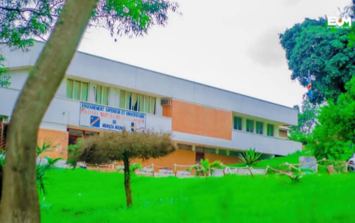

<!-- PHOTO DE L'ISP MBANZA-NGUNGU -->

# Mon Parcours Académique

### ISP Mbanza-Ngungu • Licence en Informatique et Technologie

*« Documenter son parcours académique, c'est poser des repères pour ceux qui suivront le même chemin. »*

---

<!-- SECTION : PRÉSENTATION DE L'INSTITUTION -->

### L'Institution

Je poursuis mon cursus à l'**Institut Supérieur Pédagogique de Mbanza-Ngungu (ISP)**. Cette institution forme des techniciens et des pédagogues de haut niveau, alliant une solide rigueur scientifique et technique à l'art de transmettre les connaissances et de concevoir des technologies éducatives adaptées aux enjeux de demain.

---

<!-- SECTION : LICENCE 1 -->
## Licence 1 (L1)

📖 Semestre 1 (S1)

*   **Expression orale et écrite en Français** *(Ass Bafueni)*
*   **Théorie des systèmes d'exploitation** *(CT Mpemba)*
*   **Introduction à la recherche et méthodologie du travail** *(Ass Lulengo)*
*   **Histoire et épistémologie de l'informatique** *(Ass Kizodisa)*
*   **Anglais I** *(Ass Lukau)*
*   **Informatique et société** *(Ass Kanyinda)*
*   **Mathématiques pour informaticiens** *(CT Lesa)*

<!-- LIENS PDF S1 -->

  <a href="assets/mes_docs/Cours%20Th%C3%A9orie%20des%20OS%20INF102%20L1%20%20IT.pdf" style="display: inline-flex; align-items: center; border: 1px solid var(--border, #dbdbdb); border-radius: 4px; padding: 0.5rem 1rem; text-decoration: none; font-size: 0.85rem; font-weight: bold; color: var(--text, #333); background: var(--bg, transparent);">
    <svg width="16" height="16" viewBox="0 0 24 24" fill="none" stroke="currentColor" stroke-width="2" stroke-linecap="round" stroke-linejoin="round" style="margin-right: 8px; color: var(--medium, #0056b3);"><path d="M14 2H6a2 2 0 0 0-2 2v16a2 2 0 0 0 2 2h12a2 2 0 0 0 2-2V8z"/><polyline points="14 2 14 8 20 8"/></svg>
    Théorie des OS (PDF)
  </a>

📖 Semestre 2 (S2)

*   **Didactique de l'informatique** *(CT Dikiavovako)*
*   **Valeurs, principes et symboles de la RDC** *(CT Mansanga)*
*   **Algorithmique** *(Ass Ngunda)*
*   **Statistique descriptive** *(Ass Rumbaim)*
*   **Comptabilité générale** *(CT Mbaka)*
*   **Technologie mécanique** *(Ass Diavova)*
*   **Technologie de construction** *(CT Sola K.)*

<!-- LIENS PDF S2 -->

  <a href="assets/mes_docs/Cours%20Algorithmique%20et%20Programmation.pdf" style="display: inline-flex; align-items: center; border: 1px solid var(--border, #dbdbdb); border-radius: 4px; padding: 0.5rem 1rem; text-decoration: none; font-size: 0.85rem; font-weight: bold; color: var(--text, #333); background: var(--bg, transparent);">
    <svg width="16" height="16" viewBox="0 0 24 24" fill="none" stroke="currentColor" stroke-width="2" stroke-linecap="round" stroke-linejoin="round" style="margin-right: 8px; color: var(--medium, #0056b3);"><path d="M14 2H6a2 2 0 0 0-2 2v16a2 2 0 0 0 2 2h12a2 2 0 0 0 2-2V8z"/><polyline points="14 2 14 8 20 8"/></svg>
    Cours d'Algorithmique (PDF)
  </a>

---

<!-- SECTION : LICENCE 2 -->
## Licence 2 (L2)

📖 Semestre 3 (S3)

*   **Conception et développement des matériels didactiques** *(Ass Nkelani)*
*   **Programmation impérative** *(Ass Mukoko)*
*   **Anglais II** *(Ass Lukau)*
*   **Enjeux environnementaux et sanitaires** *(CT Makubungu)*
*   **Modélisation et bases de données** *(Ass Ngunda)*
*   **Enseignement et diversité culturelle** *(CT Mbamba)*
*   **Techniques de commerce** *(CT Mbaka)*
*   **Marketing digital** *(CT Mbaka)*

<!-- LIENS PDF S3 -->

  <a href="assets/mes_docs/LivreMerisePDF-total-12sept14.pdf" style="display: inline-flex; align-items: center; border: 1px solid var(--border, #dbdbdb); border-radius: 4px; padding: 0.5rem 1rem; text-decoration: none; font-size: 0.85rem; font-weight: bold; color: var(--text, #333); background: var(--bg, transparent);">
    <svg width="16" height="16" viewBox="0 0 24 24" fill="none" stroke="currentColor" stroke-width="2" stroke-linecap="round" stroke-linejoin="round" style="margin-right: 8px; color: var(--medium, #0056b3);"><path d="M14 2H6a2 2 0 0 0-2 2v16a2 2 0 0 0 2 2h12a2 2 0 0 0 2-2V8z"/><polyline points="14 2 14 8 20 8"/></svg>
    Modélisation & BDD (PDF)
  </a>

📖 Semestre 4 (S4)

*   **Psychologie** *(CT Meno)*
*   **Comptabilité générale** *(Ass Lulengo)*
*   **AOLS** *(Dr Bonzeke)*
*   **Architecture et maintenance des ordinateurs** *(Ass Nkelani)*
*   **Programmation web** *(Ass Kanyinda)*
*   **Algorithmique et structures de données** *(Ass Mukoko)*
*   **Stage I** *(CT Lesa)*

<!-- LIENS PDF S4 -->

  <a href="assets/mes_docs/Cours%20ProgrammationWeb_L2IT.pdf" style="display: inline-flex; align-items: center; border: 1px solid var(--border, #dbdbdb); border-radius: 4px; padding: 0.5rem 1rem; text-decoration: none; font-size: 0.85rem; font-weight: bold; color: var(--text, #333); background: var(--bg, transparent);">
    <svg width="16" height="16" viewBox="0 0 24 24" fill="none" stroke="currentColor" stroke-width="2" stroke-linecap="round" stroke-linejoin="round" style="margin-right: 8px; color: var(--medium, #0056b3);"><path d="M14 2H6a2 2 0 0 0-2 2v16a2 2 0 0 0 2 2h12a2 2 0 0 0 2-2V8z"/><polyline points="14 2 14 8 20 8"/></svg>
    Programmation Web (PDF)
  </a>
  <a href="assets/mes_docs/Cours%20Algorithmique%20et%20Programmation.pdf" style="display: inline-flex; align-items: center; border: 1px solid var(--border, #dbdbdb); border-radius: 4px; padding: 0.5rem 1rem; text-decoration: none; font-size: 0.85rem; font-weight: bold; color: var(--text, #333); background: var(--bg, transparent);">
    <svg width="16" height="16" viewBox="0 0 24 24" fill="none" stroke="currentColor" stroke-width="2" stroke-linecap="round" stroke-linejoin="round" style="margin-right: 8px; color: var(--medium, #0056b3);"><path d="M14 2H6a2 2 0 0 0-2 2v16a2 2 0 0 0 2 2h12a2 2 0 0 0 2-2V8z"/><polyline points="14 2 14 8 20 8"/></svg>
    Algo & Structures de Données (PDF)
  </a>

---

<!-- SECTION : LICENCE 3 -->
## Licence 3 (L3) - Perspectives de spécialisation

*Cette section regroupe les cours théoriques et modules de spécialisation prévus pour la validation du diplôme de Licence.*

📖 Semestre 5 (S5)

*   **Didactique de l'informatique et de la technologie** *(CT Dikiavovako)*
*   **Mesure et évaluation des apprentissages** *(P. Ngoie)*
*   **Didactique de la physique et de la technologie**
*   **Gestion de classe** *(CT Mbaka)*
*   **Sécurité informatique** *(P. Ngoie)*
*   **Logiciel tableur** *(Ass Yamba)*
*   **Soutenance de rapport de stage II**

📖 Semestre 6 (S6)

*   **Technologie électronique** *(Ass Nzambi)*
*   **Programmation mobile** *(Ass Kanyinda)*
*   **Réseaux informatiques** *(P. Selain / Ass Nsumbu)*
*   **Commerce électronique** *(CT Mbaka)*
*   **Recherche opérationnelle** *(P. Ngoie R.B.)*
*   **Anglais III** *(Ass Lukau R.)*
*   **Technologie électronique** *(CT Lozolo Nkasa)*
*   **Génie logiciel** *(Ass Mampasi)*

---

Toutes les fiches techniques de révision et rapports de travaux pratiques associés à ces cours sont progressivement ajoutés et mis à jour dans le <a href="journal.md" style="font-weight: bold; color: var(--medium, #0056b3);">Journal de bord</a>.

