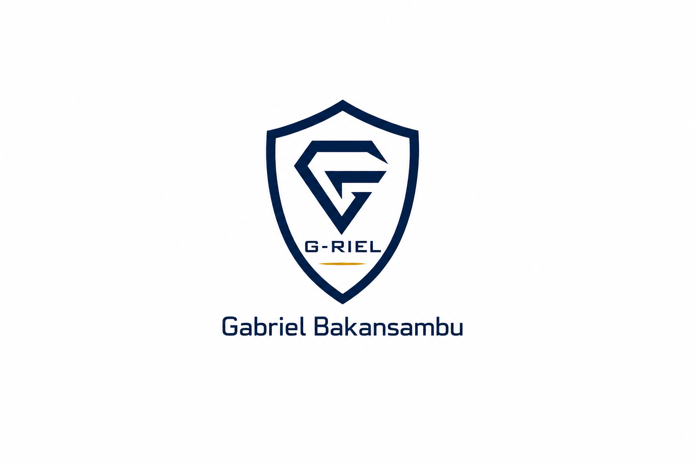

# G-RIEL
Étudiant en Informatique & Technologies • Digital Garden • Open Learning
### Construire. Apprendre. Transmettre.

*« Les connaissances prennent leur véritable valeur lorsqu'elles sont mises au service des autres. »*

**Bienvenue dans mon jardin numérique.**

Un espace où chaque projet, chaque note et chaque expérience deviennent une pierre supplémentaire dans la construction de mon parcours.

---

<!-- SECTION : QUI SUIS-JE -->

### Qui suis-je ?

Je suis convaincu que la technologie prend tout son sens lorsqu'elle permet de comprendre, de protéger et de transmettre.

Je suis **Gabriel Bakansambu**, étudiant en Informatique et Technologie à l'Institut Supérieur Pédagogique de Mbanza-Ngungu. Je développe progressivement mes compétences en conception de solutions informatiques, en administration des systèmes, en réseaux et en cybersécurité.

Initiateur de **0x430 Shadow Ops** — un laboratoire indépendant d'apprentissage, d'expérimentation et de développement de solutions technologiques, je documente à travers ce Digital Garden mon parcours, mes expérimentations et les solutions que je conçois autour des systèmes, des réseaux, de la sécurité et du génie logiciel.

<a href="a-propos.md" style="text-decoration: none; font-weight: bold;">→ En savoir plus sur mon parcours</a>

---

### Mes projets

*Chaque projet représente une étape clé de mon évolution technique et humaine.*

<!-- PROJET 1 -->

<strong>G-Lisolo</strong> 
Un projet orienté vers la création d'une solution numérique utile, pensée pour répondre à des besoins concrets. À travers G-Lisolo, j'expérimente la conception d'applications mobiles, la structuration des données et le développement d'outils adaptés aux utilisateurs.

<!-- PROJET 2 -->

<strong>Digital-Campus</strong> 
Un projet visant à explorer les possibilités offertes par le numérique dans le contexte académique. Il représente notre volonté de réfléchir à des solutions technologiques capables d'améliorer l'organisation, l'accès à l'information et les échanges dans l'environnement universitaire.    
*Projet collaboratif de TFC – Binôme : Gabriel Bakansambu & Elohime Zinga.*

<!-- PROJET 3 -->

<strong>SIGADP</strong> 
Système Informatique de Gestion et d'Automatisation des Documents Pédagogiques. Membre de cette structure collective, c'est un cadre collaboratif dans lequel je développe mes compétences en automatisation et en conception de solutions numériques.

<!-- PROJET 4 -->

<strong>G-Riel IT Garden</strong> 
Mon espace personnel construit avec Quartz 4, où je documente mes apprentissages, mes laboratoires, mes projets et mes réflexions afin de transformer chaque expérience en une ressource durable.

<a href="projets.md" style="text-decoration: none; font-weight: bold;">→ Explorer tous les projets</a>

---

<!-- SECTION : POURQUOI CE JARDIN -->

### Pourquoi ce jardin ?

Je ne cherche pas uniquement à maîtriser des technologies.  
Je cherche à **comprendre les systèmes**.  
À **construire des solutions utiles**.  
À **protéger ce qui compte**.  
Et à **transmettre** ce que j'aurai appris.

---

<!-- SECTION : CE QUE JE CONSTRUIS -->

### Ce que je construis aujourd'hui

Mes apprentissages actuels portent sur :

* **Programmation et conception logicielle** (comprendre le code ligne par ligne)
* **Bases de données** et gestion rigoureuse de l'information
* **Administration système et Réseaux informatiques**
* **Cybersécurité** et méthodes de développement de projets

« Chaque connaissance acquise devient une nouvelle pierre dans la construction de mon parcours. »

---

### Mes notes récentes

Ce Digital Garden évolue au rythme de mes apprentissages. J'y partage progressivement :
* Mes fiches techniques et mes découvertes d'outils de sysadmin et de sécurité.
* Mes réflexions sur l'administration système, Linux et l'architecture des réseaux.
* Les leçons pratiques tirées de mes développements.

*Apprendre, documenter, améliorer.*

<a href="journal.md" style="text-decoration: none; font-weight: bold;">→ Parcourir le Journal de bord</a>

---

<!-- SECTION : VALEURS -->

### Mes valeurs

* **Discipline** : Faire preuve de constance, accepter les difficultés et construire patiemment des fondations solides.
* **Curiosité** : Chercher à comprendre le fonctionnement profond des choses et explorer de nouveaux domaines sans s'arrêter à la surface.
* **Rigueur** : Construire avec méthode, analyser le code ligne par ligne, et optimiser chaque configuration.
* **Partage & Transmission** : Laisser une trace claire et utile pour ceux qui souhaitent apprendre.
* **Humilité** : Reconnaître que l'apprentissage est un chemin permanent et que chaque étape permet de progresser.

---

### Me retrouver 
Vous souhaitez suivre mon parcours ou échanger autour de la technologie ?

<!-- PANNEAU CONTENEUR GLOBAL AVEC LOGOS SVG -->

  <!-- BOUTON 1 : GITHUB -->
  <a href="https://github.com/grielbakansambu-glitch" style="display: flex; align-items: center; border: 1px solid var(--medium, #0056b3); border-radius: 6px; padding: 0.8rem 1.2rem; margin-bottom: 0.8rem; text-decoration: none; font-weight: bold; color: var(--medium, #0056b3); background: transparent;">
    <svg width="20" height="20" viewBox="0 0 24 24" fill="none" stroke="currentColor" stroke-width="2" stroke-linecap="round" stroke-linejoin="round" style="margin-right: 15px;"><path d="M9 19c-5 1.5-5-2.5-7-3m14 6v-3.87a3.37 3.37 0 0 0-.94-2.61c3.14-.35 6.44-1.54 6.44-7A5.44 5.44 0 0 0 20 4.77 5.07 5.07 0 0 0 19.91 1S18.73.65 16 2.48a13.38 13.38 0 0 0-7 0C6.27.65 5.09 1 5.09 1A5.07 5.07 0 0 0 5 4.77a5.44 5.44 0 0 0-1.5 3.78c0 5.42 3.3 6.61 6.44 7A3.37 3.37 0 0 0 9 18.13V22"></path></svg>
    GitHub
  </a>

  <!-- BOUTON 2 : FACEBOOK -->
  <a href="https://www.facebook.com/share/1F4U9BY29j/" style="display: flex; align-items: center; border: 1px solid var(--medium, #0056b3); border-radius: 6px; padding: 0.8rem 1.2rem; margin-bottom: 0.8rem; text-decoration: none; font-weight: bold; color: var(--medium, #0056b3); background: transparent;">
    <svg width="20" height="20" viewBox="0 0 24 24" fill="none" stroke="currentColor" stroke-width="2" stroke-linecap="round" stroke-linejoin="round" style="margin-right: 15px;"><path d="M18 2h-3a5 5 0 0 0-5 5v3H7v4h3v8h4v-8h3l1-4h-4V7a1 1 0 0 1 1-1h3z"></path></svg>
    Facebook
  </a>

  <!-- BOUTON 3 : TIKTOK -->
  <a href="https://vt.tiktok.com/ZSX6HXP8H/" style="display: flex; align-items: center; border: 1px solid var(--medium, #0056b3); border-radius: 6px; padding: 0.8rem 1.2rem; margin-bottom: 0.8rem; text-decoration: none; font-weight: bold; color: var(--medium, #0056b3); background: transparent;">
    <svg width="20" height="20" viewBox="0 0 24 24" fill="none" stroke="currentColor" stroke-width="2" stroke-linecap="round" stroke-linejoin="round" style="margin-right: 15px;"><path d="M9 12a4 4 0 1 0 4 4V4a5 5 0 0 0 5 5"></path></svg>
    TikTok
  </a>

  <!-- BOUTON 4 : WHATSAPP -->
  <a href="https://wa.me/243840609505" style="display: flex; align-items: center; border: 1px solid var(--medium, #0056b3); border-radius: 6px; padding: 0.8rem 1.2rem; text-decoration: none; font-weight: bold; color: var(--medium, #0056b3); background: transparent;">
    <svg width="20" height="20" viewBox="0 0 24 24" fill="none" stroke="currentColor" stroke-width="2" stroke-linecap="round" stroke-linejoin="round" style="margin-right: 15px;"><path d="M21 11.5a8.38 8.38 0 0 1-.9 3.8 8.5 8.5 0 0 1-7.6 4.7 8.38 8.38 0 0 1-3.8-.9L3 21l1.9-5.7a8.38 8.38 0 0 1-.9-3.8 8.5 8.5 0 0 1 4.7-7.6 8.38 8.38 0 0 1 3.8-.9h.5a8.48 8.48 0 0 1 8 8v.5z"></path></svg>
    WhatsApp
  </a>

---

**Construire avec intelligence.  
Protéger avec intégrité.  
Transmettre avec humilité.**

Gabriel Bakansambu

