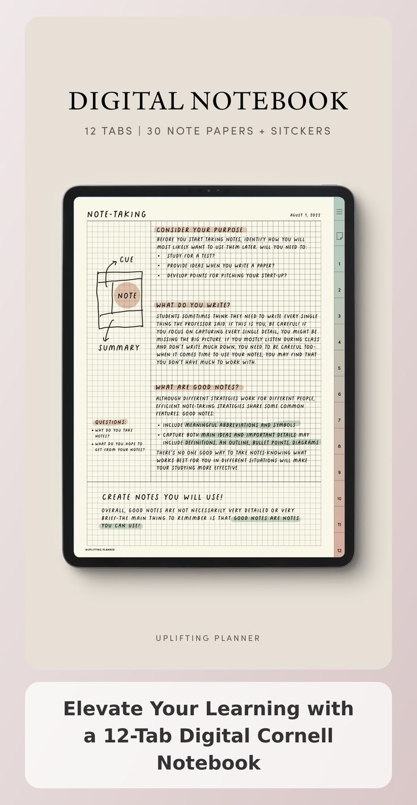

<!-- 1. EN-TÊTE -->

# Mon Journal d'Apprentissage

### Notes techniques • Expérimentations • Veille technologique

---

<!-- 2. PHILOSOPHIE DU JOURNAL (CORRIGÉE) -->

Ce journal représente la mémoire de mon parcours d'apprentissage en informatique. 
J'y documente mes expérimentations, mes recherches, les difficultés rencontrées lors de mes travaux pratiques et les solutions découvertes.
  
L'objectif est simple : transformer chaque expérience technique en connaissance durable et construire progressivement mon expertise.

---

<!-- 3. DOMAINES EXPLORÉS & CATÉGORIES -->

  <h2 style="margin: 0; font-size: 1.5rem;">📚 Domaines explorés</h2>
  

    Mes notes et publications s'organisent autour de plusieurs thématiques clés que j'explore au quotidien :
  

  <!-- DEVELOPPEMENT -->
  

    

      <h4 style="display: flex; align-items: center; gap: 8px; margin-top: 0; margin-bottom: 8px; font-size: 1rem;">
        <svg width="18" height="18" viewBox="0 0 24 24" fill="none" stroke="#0056b3" stroke-width="2" stroke-linecap="round" stroke-linejoin="round"><polyline points="16 18 22 12 16 6"/><polyline points="8 6 2 12 8 18"/></svg>
        Développement
      </h4>
      
Création d'applications, architectures mobiles, modélisation et gestion de bases de données.

    

  

  <!-- SYSTEMES & RESEAUX -->
  

    

      <h4 style="display: flex; align-items: center; gap: 8px; margin-top: 0; margin-bottom: 8px; font-size: 1rem;">
        <svg width="18" height="18" viewBox="0 0 24 24" fill="none" stroke="#0056b3" stroke-width="2" stroke-linecap="round" stroke-linejoin="round"><rect x="3" y="4" width="18" height="14" rx="2"/><line x1="8" y1="20" x2="16" y2="20"/><line x1="12" y1="18" x2="12" y2="20"/></svg>
        Systèmes & Réseaux
      </h4>
      
Administration Linux, maquettage de topologies, virtualisation et routage IP.

    

  

  <!-- CYBERSECURITE -->
  

    

      <h4 style="display: flex; align-items: center; gap: 8px; margin-top: 0; margin-bottom: 8px; font-size: 1rem;">
        <svg width="18" height="18" viewBox="0 0 24 24" fill="none" stroke="#0056b3" stroke-width="2" stroke-linecap="round" stroke-linejoin="round"><path d="M12 22s8-4 8-10V5l-8-3-8 3v7c0 6 8 10 8 10z"/></svg>
        Cybersécurité
      </h4>
      
Apprentissage de la sécurité offensive et défensive, veille vulnérabilités et CTF.

    

  

  <!-- ACADEMIQUE & REFLEXIONS (CORRIGÉ) -->
  

    

      <h4 style="display: flex; align-items: center; gap: 8px; margin-top: 0; margin-bottom: 8px; font-size: 1rem;">
        <svg width="18" height="18" viewBox="0 0 24 24" fill="none" stroke="#0056b3" stroke-width="2" stroke-linecap="round" stroke-linejoin="round"><path d="M22 19a2 2 0 0 1-2 2H4a2 2 0 0 1-2-2V5a2 2 0 0 1 2-2h5l2 3h9a2 2 0 0 1 2 2z"/></svg>
        Parcours & Réflexions
      </h4>
      
Bilans académiques, retours d'expérience sur mes stages et réflexions sur mes méthodes d'étude.

    

  

---

<!-- 4. CARNET DE BORD CHRONOLOGIQUE (CORRIGÉ) -->

  <h2 style="margin: 0; font-size: 1.5rem;"> Carnet de bord (2026)</h2>
  

    Retrouvez ici mes notes organisées chronologiquement, retraçant mes expérimentations, mes découvertes techniques et les étapes importantes de mon parcours informatique.
  

### Juillet 2026
*   **[[journal/2026-07-13-fin-examens|Bilan académique et planification des expérimentations]]** : Réflexion sur la fin des examens de Licence 2 et feuille de route pour mes prochaines expérimentations techniques.
*   **[[journal/2026-07-02-gestion-bases-donnees|Exploration et requêtes SQL avancées]]** : Prise de notes sur l'implémentation et l'optimisation de schémas relationnels sous MySQL et SQLite.

### Juin 2026
*   **[[journal/2026-06-22-soutenance-stage|Retour d'expérience sur mon stage pédagogique en informatique]]** : Retour d'expérience sur la présentation de mon rapport et l'application pratique de la pédagogie aux cours d'informatique.
*   **[[journal/2026-06-15-reseau-vlan-packet-tracer|Laboratoire VLAN & Routage]]** : Configuration d'une topologie d'entreprise sous Cisco Packet Tracer, adressage DHCP et gestion des politiques d'accès (ACLs).
*   **[[journal/2026-06-05-initiation-arch-linux|Installation d'une distribution Arch Linux]]** : Documentation de ma procédure d'installation manuelle en machine virtuelle et exploration de la gestion système sous Linux.

### Mai 2026
*   **[[journal/2026-05-28-creation-it-club|Lancement de l'initiative IT_CLUB]]** : Mise en place d'un espace d'entraide alternatif pour faciliter le partage de ressources techniques au sein de notre promotion académique.
*   **[[journal/2026-05-18-analyse-sigadp|Début de l'analyse Merise pour SIGADP]]** : Sessions de travail sur la structuration des bases de données et la modélisation conceptuelle (MCD) du projet.

---

<!-- 5. METHODOLOGIE DE REDACTION (CORRIGÉE) -->

  <h2 style="margin: 0; font-size: 1.5rem;">⚙️ Ma méthode de prise de notes techniques</h2>

Pour m'assurer que mes notes restent structurées et utiles à long terme, chaque entrée de ce journal suit une démarche rigoureuse en quatre étapes :

  <!-- STEP 1 -->
  

    01
    <h4 style="margin-top: 0.5rem; margin-bottom: 0.5rem; font-size: 0.95rem;">Le Problème</h4>
    
Définir précisément le dysfonctionnement ou l'objectif technique recherché.

  

  <!-- STEP 2 (CORRIGÉE) -->
  

    02
    <h4 style="margin-top: 0.5rem; margin-bottom: 0.5rem; font-size: 0.95rem;">La Démarche</h4>
    
Consigner les commandes utilisées, les extraits de code, les configurations testées et les schémas de conception.

  

  <!-- STEP 3 -->
  

    03
    <h4 style="margin-top: 0.5rem; margin-bottom: 0.5rem; font-size: 0.95rem;">Les Obstacles</h4>
    
Analyser les messages d'erreur et identifier pourquoi le système s'est bloqué.

  

  <!-- STEP 4 -->
  

    04
    <h4 style="margin-top: 0.5rem; margin-bottom: 0.5rem; font-size: 0.95rem;">La Résolution</h4>
    
Expliquer ce qui a résolu le problème et documenter les bonnes pratiques retenues.

  

