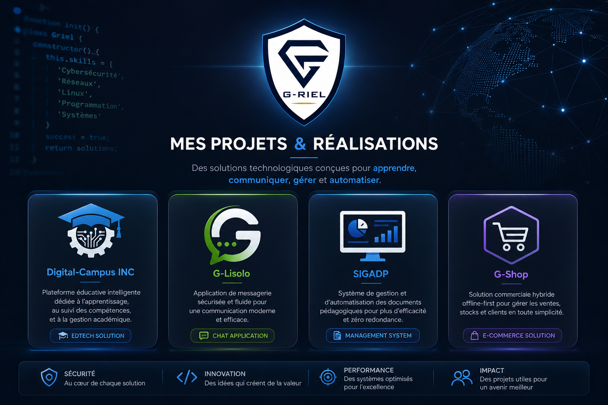
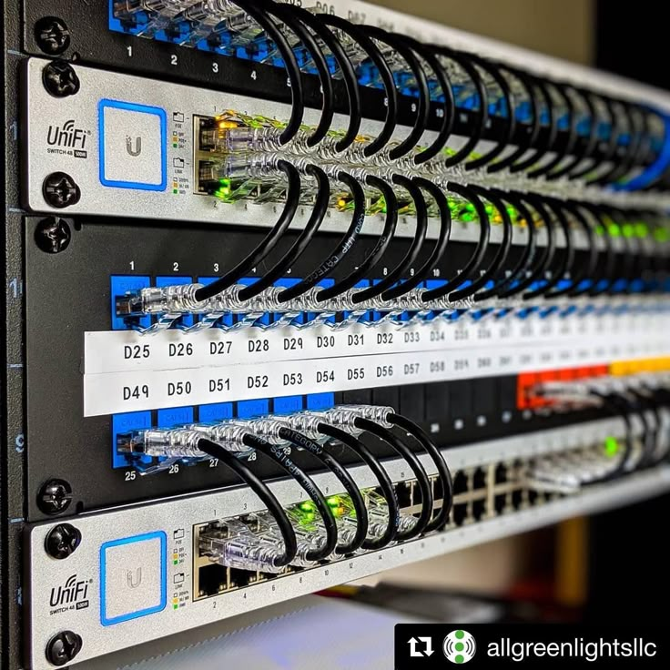

# Projets & Expérimentations Techniques

### Développement • Systèmes • Réseaux • Cybersécurité

---

<h3 style="margin-top: 0; margin-bottom: 0.75rem; font-size: 1.2rem;">Mon approche d'apprentissage</h3>

Cette section présente les projets réalisés au cours de mon parcours d'apprentissage en informatique. 
Chaque projet représente une étape d'expérimentation permettant de mettre en pratique des notions de programmation, de conception de bases de données, de développement mobile, de systèmes et de réseaux.

L'objectif n'est pas seulement de créer des applications, mais de comprendre les principes fondamentaux qui se cachent derrière les technologies utilisées : analyse du besoin, modélisation, développement, tests et documentation.

---

  <h2 style="margin: 0; font-size: 1.5rem;">Projets réalisés</h2>

  

    

      

        
        Projet personnel
      

      <h3 style="margin-top: 0; margin-bottom: 0.5rem; font-size: 1.2rem;">Digital-Campus</h3>
      
Plateforme numérique visant à explorer la gestion des activités académiques et l'organisation des ressources d'apprentissage. Ce projet permet d'expérimenter la conception d'une application complète avec base de données.

      
<strong>Environnement :</strong> Flutter • PHP • MySQL • UML/Merise

    

    

      Documentation en préparation
    

  

  

    

      

        
        Projet académique
      

      <h3 style="margin-top: 0; margin-bottom: 0.5rem; font-size: 1.2rem;">SIGADP</h3>
      
Système Informatique de Gestion et d'Automatisation des Documents Pédagogiques. Analyse et conception d'une solution pour faciliter la gestion des documents via une modélisation structurée.

      
<strong>Environnement :</strong> Merise • UML • SQL • SGBD relationnel

    

    

      <a href="https://github.com/G-RIEL/SIGADP" style="display: block; text-align: center; border: 1px solid #dbdbdb; border-radius: 4px; padding: 0.4rem; text-decoration: none; font-size: 0.85rem; font-weight: bold; color: inherit; background: #f5f5f5; transition: background 0.2s;">Voir l'analyse du projet</a>
    

  

  

    

      

        
        En développement
      

      <h3 style="margin-top: 0; margin-bottom: 0.5rem; font-size: 1.2rem;">G-Lisolo</h3>
      
Application mobile de messagerie développée pour explorer la communication client-serveur. Focus sur la gestion des utilisateurs, les API REST et la manipulation de bases de données distantes.

      
<strong>Environnement :</strong> Flutter/Dart • PHP API • MySQL

    

    

      <a href="https://github.com/G-RIEL/G-Lisolo" style="display: block; text-align: center; border: 1px solid #dbdbdb; border-radius: 4px; padding: 0.4rem; text-decoration: none; font-size: 0.85rem; font-weight: bold; color: inherit; background: #f5f5f5; transition: background 0.2s;">Dépôt du projet</a>
    

  

  

    

      

        
        Publication web
      

      <h3 style="margin-top: 0; margin-bottom: 0.5rem; font-size: 1.2rem;">G-RIEL IT Garden</h3>
      
Mon espace numérique personnel dédié à la documentation de mon apprentissage. Il rassemble mes notes techniques, mes recherches, mes laboratoires et mes réflexions.

      
<strong>Environnement :</strong> Quartz 4 • Markdown • Obsidian • GitHub Pages

    

    

      <a href="https://github.com/G-RIEL/griel-it-garden" style="display: block; text-align: center; border: 1px solid #dbdbdb; border-radius: 4px; padding: 0.4rem; text-decoration: none; font-size: 0.85rem; font-weight: bold; color: inherit; background: #f5f5f5; transition: background 0.2s;">Explorer le jardin numérique</a>
    

  

---

  <h2 style="margin: 0; font-size: 1.5rem;">Laboratoires & Expérimentations</h2>
  

    En complément des projets logiciels, je réalise des expérimentations pratiques afin de mieux comprendre les environnements informatiques, les systèmes et les réseaux.
  

  

    

      
      <h4 style="display: flex; align-items: center; gap: 10px; margin-top: 0; margin-bottom: 8px;">
        <svg width="20" height="20" viewBox="0 0 24 24" fill="none" stroke="currentColor" stroke-width="2" stroke-linecap="round" stroke-linejoin="round" style="color: #0056b3;"><rect x="3" y="4" width="18" height="14" rx="2"/><line x1="8" y1="20" x2="16" y2="20"/><line x1="12" y1="18" x2="12" y2="20"/></svg>
        Linux & Systèmes
      </h4>
    

    
Exploration des environnements Linux (Ubuntu, Kali Linux, Debian), administration de base, gestion des services, utilisation de machines virtuelles et découverte des outils système.

    
<strong>Technologies :</strong> Linux • VirtualBox • Bash • Administration

  

  

    

      
      <h4 style="display: flex; align-items: center; gap: 10px; margin-top: 0; margin-bottom: 8px;">
        <svg width="20" height="20" viewBox="0 0 24 24" fill="none" stroke="currentColor" stroke-width="2" stroke-linecap="round" stroke-linejoin="round" style="color: #0056b3;"><circle cx="12" cy="5" r="2"/><circle cx="5" cy="19" r="2"/><circle cx="19" cy="19" r="2"/><line x1="12" y1="7" x2="5" y2="17"/><line x1="12" y1="7" x2="19" y2="17"/><line x1="5" y1="19" x2="19" y2="19"/></svg>
        Réseaux
      </h4>
    

    
Mise en pratique des concepts réseaux à travers la création de topologies virtuelles, l'étude de l'adressage IP, du routage, des VLAN et des mécanismes de communication.

    
<strong>Technologies :</strong> Cisco Packet Tracer • TCP/IP • VLAN • Routage

  

  

    

      
      <h4 style="display: flex; align-items: center; gap: 10px; margin-top: 0; margin-bottom: 8px;">
        <svg width="20" height="20" viewBox="0 0 24 24" fill="none" stroke="currentColor" stroke-width="2" stroke-linecap="round" stroke-linejoin="round" style="color: #0056b3;"><path d="M12 22s8-4 8-10V5l-8-3-8 3v7c0 6 8 10 8 10z"/></svg>
        Cybersécurité
      </h4>
    

    
Découverte progressive de la cybersécurité à travers des laboratoires d'apprentissage, l'utilisation d'outils d'analyse et l'étude des bonnes pratiques de protection des systèmes.

    
<strong>Technologies :</strong> Kali Linux • Analyse réseau • Sécurité système

  

---

  <h2 style="margin: 0; font-size: 1.5rem;">Technologies & Outils explorés</h2>

  

    <h4 style="margin-top: 0; margin-bottom: 0.5rem; font-size: 1rem; color: #0056b3;">Développement</h4>
    <ul style="padding-left: 1.1rem; margin: 0; font-size: 0.85rem; line-height: 1.5;">
      <li>Flutter / Dart</li>
      <li>PHP</li>
      <li>HTML / CSS / JS</li>
    </ul>
  

  

    <h4 style="margin-top: 0; margin-bottom: 0.5rem; font-size: 1rem; color: #0056b3;">Bases de Données</h4>
    <ul style="padding-left: 1.1rem; margin: 0; font-size: 0.85rem; line-height: 1.5;">
      <li>MySQL</li>
      <li>SQLite</li>
      <li>Microsoft Access</li>
    </ul>
  

  

    <h4 style="margin-top: 0; margin-bottom: 0.5rem; font-size: 1rem; color: #0056b3;">Modélisation</h4>
    <ul style="padding-left: 1.1rem; margin: 0; font-size: 0.85rem; line-height: 1.5;">
      <li>Merise</li>
      <li>UML</li>
    </ul>
  

  

    <h4 style="margin-top: 0; margin-bottom: 0.5rem; font-size: 1rem; color: #0056b3;">Systèmes & Outils</h4>
    <ul style="padding-left: 1.1rem; margin: 0; font-size: 0.85rem; line-height: 1.5;">
      <li>Linux / VirtualBox</li>
      <li>Git / GitHub</li>
      <li>VS Code / Obsidian</li>
    </ul>
  

